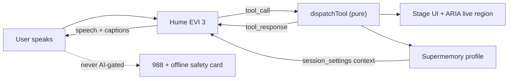

# Anchor

**A voice that picks up at 3am.**

## Brief description (PromptWars Requirement 4)

Anchor is a multi-modal, GenAI-powered recovery and prevention companion for people living with a substance use disorder. During a craving or a crisis, typing is impossible — hands shake, thoughts scatter, and a chat box is the worst possible interface. So Anchor has no chat box at its centre. The user presses one control and talks. Hume's Empathic Voice Interface hears the distress in their voice and **drives the entire screen through tool calls**: opening a breathing pacer, starting an urge-surf timer, surfacing their own reasons for recovery in their own words, or writing them a ready-to-send message so they can leave a room.

The user never types. That is the product.

A hardcoded 988 button and offline safety card stay available even if GenAI or the network fails — crisis help is never model-gated.

---

## GenAI services used & where (PromptWars Requirement 5)

| GenAI / AI service | What it does in Anchor | Where it is wired |
| --- | --- | --- |
| **Hume AI Empathic Voice Interface (EVI 3)** | Live speech-in / speech-out companion; prosody-aware emotion; supplemental LLM (Claude via Hume config) reasons and **calls tools** that open UI interventions; authors emergency script text into tool parameters | Client: [components/Anchor.tsx](components/Anchor.tsx) (`VoiceProvider`, `onToolCall`, captions). Token mint: [app/page.tsx](app/page.tsx). Tools + system prompt provisioned by [scripts/setup-hume.mjs](scripts/setup-hume.mjs) from [lib/tools/hume-tools.json](lib/tools/hume-tools.json). Dispatch: [lib/tools/dispatch.ts](lib/tools/dispatch.ts) |
| **Supermemory** | Cross-session personalization: profile + memories injected into EVI via `session_settings` context; mid-call `remember_this` and end-of-session writes | [lib/memory.ts](lib/memory.ts), [app/api/memory/profile/route.ts](app/api/memory/profile/route.ts), [app/api/memory/add/route.ts](app/api/memory/add/route.ts), injected from [components/Anchor.tsx](components/Anchor.tsx) |

**Not GenAI (intentionally):** the 988 / Never Use Alone / SAMHSA numbers and the offline safety card in [components/SafetyRail.tsx](components/SafetyRail.tsx), and the vetted education copy in [lib/resources.ts](lib/resources.ts) (EVI only chooses the topic; wording is human-authored).

**Functional honesty:** Voice features require live Hume API + secret keys and a config ID (from `npm run setup:hume`). Memory personalization requires a Supermemory API key. Prefer `.env`; for demos, paste the same keys via the **Settings** hamburger (sessionStorage). There are no mocked GenAI responses in the demo path.

---

## Requirement traceability

| Requirement from the brief | How Anchor implements it | Where |
| --- | --- | --- |
| Multi-modal | Speech in, speech out, live captions, on-screen panels, one-tap `tel:`/`sms:` handoff, and a typed fallback for users who cannot speak | [components/Anchor.tsx](components/Anchor.tsx), [components/stage/Stage.tsx](components/stage/Stage.tsx) |
| GenAI as a core engine | EVI is not a chatbot bolted on; it is the controller. Every intervention is opened by a model tool call, and it authors emergency scripts directly into tool parameters | [lib/tools/dispatch.ts](lib/tools/dispatch.ts), [lib/tools/hume-tools.json](lib/tools/hume-tools.json) |
| Zero-typing interventions | Grounding, urge surfing, reason recall, and support contact all open without a keystroke | [components/stage/Breathing.tsx](components/stage/Breathing.tsx), [components/stage/UrgeSurf.tsx](components/stage/UrgeSurf.tsx) |
| Personalized emergency scripts | EVI writes the complete script, personalised by the user's memory profile, and the UI renders it for copy or send | `write_emergency_script` in [lib/tools/dispatch.ts](lib/tools/dispatch.ts) |
| Backed by educational resources | A human-authored, source-attributed harm-reduction library. The model picks the topic; it never writes the health facts | [lib/resources.ts](lib/resources.ts) |
| Contextual safety tools | Distress in the voice adapts EVI's pacing; a hardcoded 988 rail and an offline safety card work with no network at all | [lib/prosody.ts](lib/prosody.ts), [components/SafetyRail.tsx](components/SafetyRail.tsx) |
| Caregivers | The safety card is a shareable "how to help me" summary built from the user's own words | [components/SafetyRail.tsx](components/SafetyRail.tsx) |
| Highest cognitive load | One control, one panel at a time, short spoken sentences, and nothing the user must remember to ask for | [components/Anchor.tsx](components/Anchor.tsx) |

---

## Architecture



The load-bearing decision is that **all intervention logic is a pure function**. `dispatchTool(name, rawParameters, context)` takes a tool call and returns the panel to render plus the line EVI should say. It touches no React, no network, and no browser globals, which means every intervention is directly unit-testable without mounting a component or opening a socket.

## Safety model

This is a health application for a population where a bad interaction can be fatal, so three rules are enforced structurally rather than by prompt alone:

1. **The crisis path never depends on the AI.** The 988 button and the offline safety card are hardcoded and always visible. They work with no network, no API keys, and no model.
2. **Emotion is a signal, never a gate.** Prosody adapts EVI's pacing and feeds the trigger timeline. It never decides whether someone gets help.
3. **The model does not author health facts.** `show_resource` picks a topic from a fixed, human-written, source-attributed library. Dosing and medical advice are out of scope by construction.

The stance throughout is harm reduction. If someone says they are going to use, Anchor does not argue or withdraw — it surfaces tolerance-loss risk and the Never Use Alone line, because a person who is alive can recover later.

## Security

- `HUME_API_KEY`, `HUME_SECRET_KEY`, and `SUPERMEMORY_API_KEY` are server-side only. The browser receives a short-lived Hume access token, never a key, and never calls Supermemory directly (`connect-src` is `'self'` + Hume only).
- **Settings hamburger** ([components/SettingsDrawer.tsx](components/SettingsDrawer.tsx)): evaluators can paste Hume + Supermemory keys into **sessionStorage** for a live demo without editing `.env`. Those keys are POSTed / sent as `x-supermemory-key` to our API routes only for that request; they are not persisted server-side.
- `NEXT_PUBLIC_HUME_CONFIG_ID` is intentionally public. It is an identifier, not a credential (also pasteable via Settings).
- Every API route validates its body with zod before touching a third party ([lib/schemas.ts](lib/schemas.ts)); token and memory routes are rate-limited.
- Identity is an anonymous client-generated UUID. No name, email, or phone number is ever sent to the server as an identifier.
- Memory content is never written to server logs. It contains disclosures about drug use and family.
- Model-authored text is rendered as text nodes. There is no `dangerouslySetInnerHTML` in the codebase, and every `tel:`/`sms:` href is rebuilt from an allowlist in [lib/sanitize.ts](lib/sanitize.ts), so a `javascript:` payload cannot become a link.
- CSP, HSTS, `frame-ancestors 'none'`, and a `Permissions-Policy` that grants microphone only to self are set in [next.config.ts](next.config.ts).

## Accessibility

Accessibility here is a product requirement, not a compliance pass. A voice-only interface would exclude deaf and hard-of-hearing users, and anyone in a shared house or a public place who cannot speak aloud — a very common situation for the people this is built for.

- EVI's speech is mirrored into an `aria-live="polite"` caption region, so the app works with the sound off.
- A typed fallback reaches every intervention for users who cannot speak.
- The talk control is a real `<button>` with `aria-pressed`, fully keyboard operable, with a visible focus ring.
- Stage changes move focus to the new panel and announce it.
- The breathing pacer honours `prefers-reduced-motion`. Large looping motion can intensify panic and nausea, so the reduced variant keeps the cadence and drops the animation.
- Semantic landmarks and a skip link in [app/layout.tsx](app/layout.tsx).

## Efficiency

- Prosody messages arrive on nearly every utterance, so the handler samples at most once every 1.2 seconds and the emotion timeline is a capped ring buffer that cannot grow unbounded.
- The memory profile is fetched once per session with an `AbortController`, not per message.
- `Stage` is memoised; every `setInterval` in the timer widgets is cleared on unmount.
- The voice client is `dynamic()`-imported with `ssr: false`, since it needs microphone APIs that do not exist on the server.

## Testing

```bash
npm test
```

Covers the pure core: tool dispatch for all seven tools, unknown tools and malformed JSON failing closed, schema rejection of out-of-range parameters, prosody top-N and ring-buffer capping, URI sanitisation rejecting `javascript:` payloads, and a contract test that fails if the uploaded tool JSON ever drifts from the runtime validator.

## Getting started

```bash
npm install
cp .env.example .env        # add your Hume and Supermemory keys (or use Settings in the UI)
npm run setup:hume          # creates the tools + config, prints the config ID
# paste NEXT_PUBLIC_HUME_CONFIG_ID into .env (or Settings)
npm run dev
```

## Try it

Say: *"I'm at a party and I really want to use."*

Anchor hears the anxiety, opens a breathing pacer without being asked, reads back a reason for staying sober that you gave it in an earlier session, and writes a message you can send to leave. Zero keystrokes, and every word captioned.

---

Built on Hume's [EVI Next.js function-calling example](https://github.com/HumeAI/hume-api-examples/tree/main/evi/evi-next-js-function-calling) (MIT).

**Anchor is not a therapist, a doctor, or an emergency service.** If you are in crisis in the US, call or text 988.
